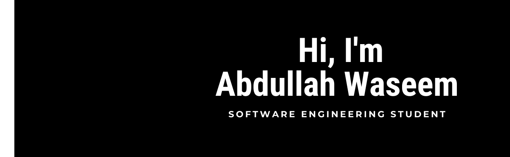

## Hey there 👋

I’m Abdullah, a software engineering student, with a passion for solving problems with code.

Want to know more about me? [Check out my portfolio.](https://abdullahwaseem.com)

 

## 📌 Pinned Repositories

 
 
  
## 💼 Skills

-informational?style=flat&logo=oracle&logoColor=white&color=c84734)

 
  
 
 ## &#x1f4c8; GitHub Stats
 
  

  <!-- ## Daily Office Quote
  > {office_quote}
  >
  > 
{office_character}
 -->
